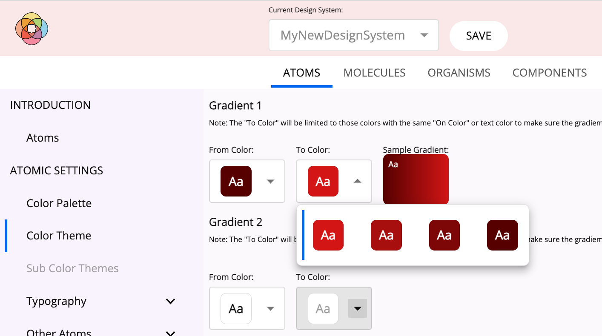
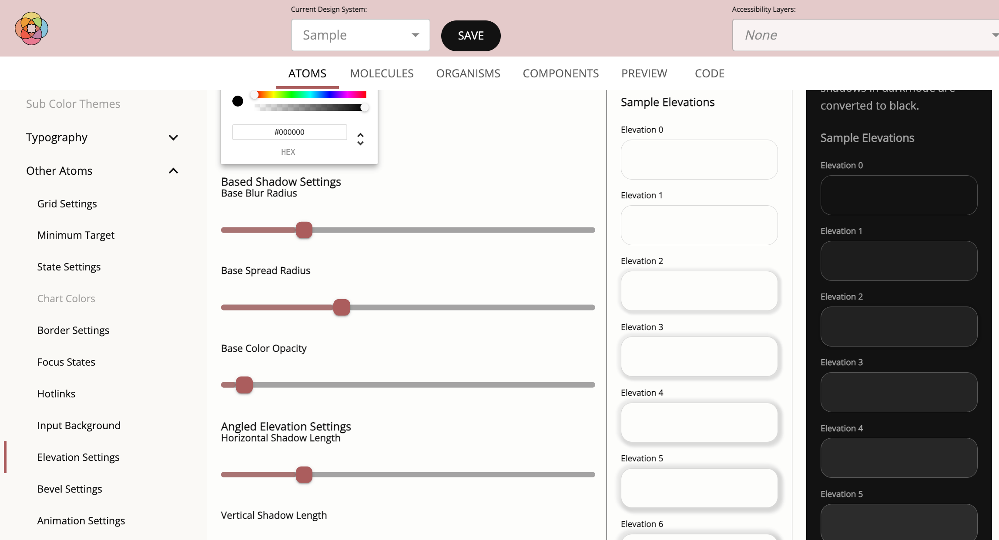
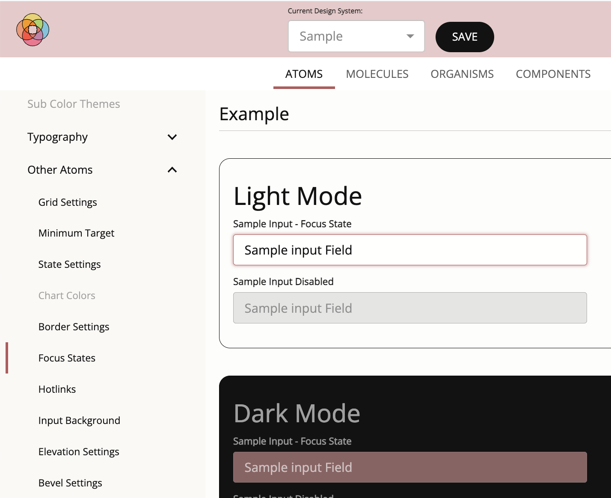
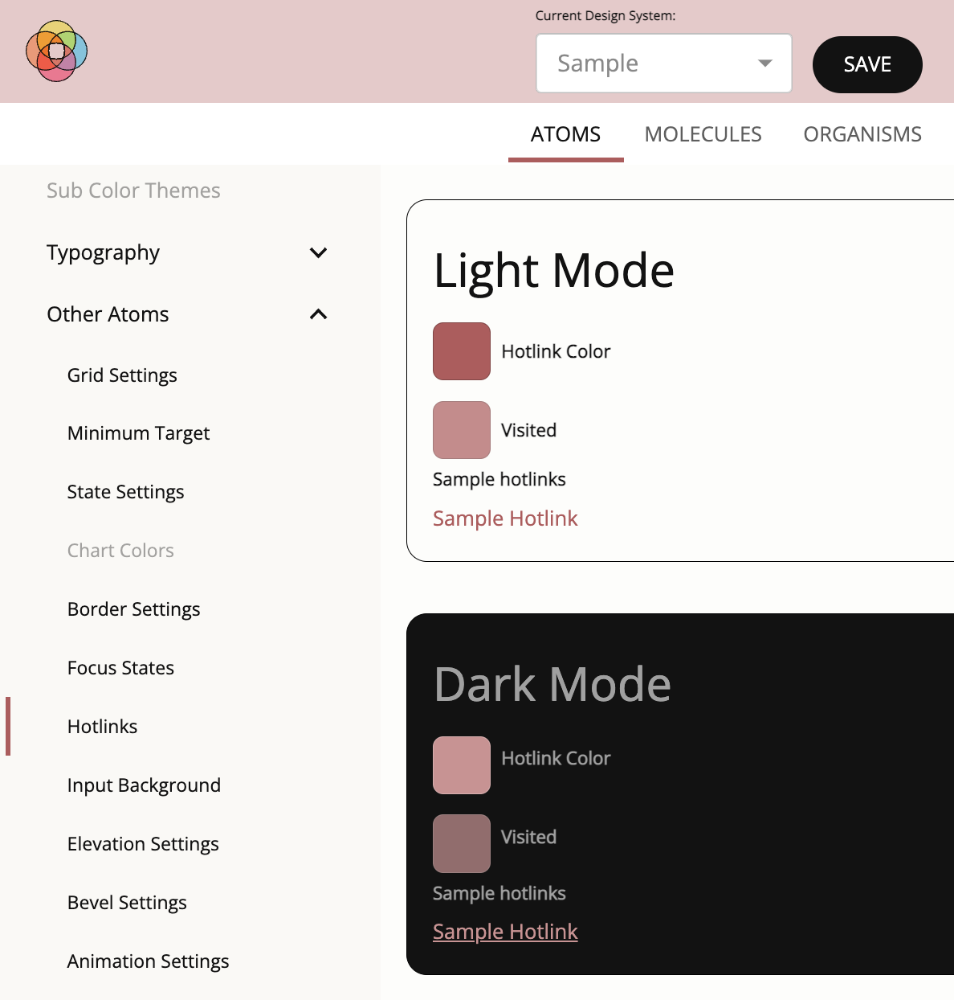
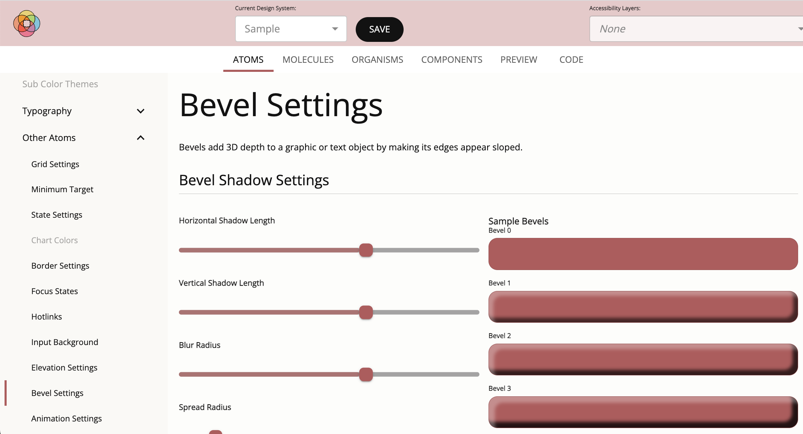

# Foundational Services

## Concepts
The following concepts are used in computations.

* **on-color**: [Google Material Design][M2DESIGN] refers to the [color elements](https://m2.material.io/design/color/the-color-system.html#color-theme-creation) that appear “on” top of surfaces that use the following colors: a primary color, secondary color, surface color, background color, or error color, as "on" colors. When a color appears “on” top of a primary color, it’s called an “on primary color.” They are labelled using the original color category (such as primary color) with the prefix “on”. These “On” colors are primarily applied to text, iconography, and strokes.

## Computational Instructions
### Light and Dark Mode Shades
0. For a selected color, identify the color's LIGHTNESS_VALUE with respect to a scale from 0-1 to associate it with a SHADE_LEVEL. To compute the LIGHTNESS_VALUE, convert the ordinal HEX color to RGB and then RGB to HSL (Hue, Saturation, Lightness).

    | Shade Level | Lightness Value Range |
    | --- | --- |
    | 0  | .9 to 1 |
    | 100| .8 to .9|
    | 200| .7 to .8|
    | 300| .6 or .7|
    | 400| .5 to .6|
    | 500| .4 to .5|
    | 600| .3 to .4|
    | 700| .2 tp .3|
    | 800| .1 to .2|
    | 900| 0 to .1 |

0. For light mode shade adjustments, compute LIGHT_MODE_LIGHTNESS per SHADE_LEVEL. First compute the MULTIPLIER for calculating all the lightness per shades levels.
    ```
    MULTIPLIER = LIGHTNESS_VALUE - (900 - SHADE_LEVEL)/1000
    For 0 to 900 by 100:
      LIGHT_MODE_LIGHTNESS = ((900 - SHADE_LEVEL) + MULTIPLIER)/1000
    ```
    If the LIGHTNESS_VALUE is >= .97 then the LIGHTNESS_VALUE is .97 and if the LIGHTNESS_VALUE is darker than .05 then the DARKNESS_VALUE is .05.  This prevents the lightest color from becoming too white and the dark color from becoming too dark.

0. Dark mode shade adjustments are computed by decreasing the lightness. This means the light shades are reduced more than the dark shades.

    ```
      REDUCTION_VALUE = (900-SHADE_VALUE)/1000
      For 0 to 900 by 100:
        DARK_MODE_LIGHTNESS = (((900 - SHADE_VALUE)/1000) - (.075 * REDUCTION_VALUE )
    ```

0. Calculate each color by taking the original HSL value, updating each shade with the new calculated lightness value, and then convert the color from HSL back to RGB.
0. Check the swatch and its color contrast against light and dark text to see which has a higher contrast.
    * In light mode dark text is "\#121212" and light text is "\#ffffff"
    * In dark mode dark text is "\#121212" and light text is "rgba(255,255,255,0.6)"
0. Check with resulting color and text color combination to calculate its contrast ratio.  If it has a contrast ratio of 4.5:1 or higher compute the swatch with the corresponding text or 'On-Color'.
0. If the contrast is < 4.5:1, test to see if it takes more cycles to lighten the color with dark text or darken the color with light text to get to the desired contrast ratio of 4.5:1.
0. Loop through a function to lighten or darken the shade until it has an on-color with a contrast ratio of 4.5:1.
0. Smooth out the transitions through the colors so there are no obvious jumps by identifying those colors that have been lightened or darkened, and placing the corresponding shade along a gradient to the lightest and darkest shades and updating the shades in-between at equal percentage intervals.

### Gradients



* Light Mode Color Selection

    1. Once the user selects the primary, secondary, and tertiary colors of a theme, a menu will be generated for the user to select the first color, color "a", of a gradient, from the shades generated for the primary, secondary, and tertiary colors.
    2. Once the "a" color is selected only those colors of the primary, secondary and tertiary shades with the same "on-color" as "a" can be selected by the user for color "b".
    3. Any text or icon used on the full gradient will now meet the required 4.5:1 contrast.

* Dark Mode Color Selection

    1. If color "a" and "b" are the same color and shade 500 or higher, identify dark "on-colors" and proceed to map the same jump in shade values as the user picked in light mode.
    2. If there are not 2 or more dark "on-color" shades, then look at all of the light "on-color" shades to build a gradient with the same jump in shades.
    3. This yields gradients in dark mode that are not too bright or light for the eyes and "a" and "b" shades that have the same "on-color," keeping it accessible.

### Icons and Buttons

1. User selects values for the following preferences.  These are required in order to specify icon and button colors in the default color theme.
    1. Primary, secondary, and tertiary colors
    1. Light mode background colors
    1. Dark mode background colors
1. Build light mode accessible buttons
    1. Limit the selection of button colors to those primary, secondary, and tertiary shades that have a contrast against the secondary light mode background color of 3.1:1 or higher.  Note secondary background needs to be slightly darker than the primary background.
1. Build dark mode accessible buttons
    1. Start with the users selected light mode button shade and test it against their selected primary dark mode background color selection, which is slightly darker than the secondary background color.
    2. If the button does not have the required contrast, then loop through the lighter shades until finding an appropriate shade.
1. Repeat steps 2-3 for icon color.

### Elevations



* In light mode elevations are represented with increasing dropshadows.
    * To calculate the elevations, gather information from the user about the base dropshadow.
        * color of the shadow
        * horizontal distance
        * vertical distance
        * blur
        * spread
    * User specifies desired change between elevations.
    * Compute 10 elevations, consistently increasing dropshadow styles to represent the 10  elevations in light mode.
* In dark mode, instead of elevations being represented by increasing dropshadows as they are in light mode, elevations are represented by increasing lightness.
    * Use the background color which serves as the elevation 0 shade and apply an increasing white overlay on the background color to generate 10 elevations.
    * Leverage the [Material Design][M2DESIGN] elevation calculations to determine the  appropriate lightness.

### Minimum Click Area Control

>Note: WCAG 2.1 AA requires desktop applications to have a target click area of 24px.

The user can select the desired MINIMUM_CLICK_AREA for their desktop application.

  * By default the MINIMUM_CLICK_AREA will change to 44px for tablet and mobile interfaces.

It is possible to create clickable elements that meet the MINIMUM_CLICK_AREA selected but appear smaller:

  1. Wrap the component in a parent that is, in fact, the identified MINIMUM_CLICK_AREA but then make the visual elements of the wrapped component smaller (e.g. 24px).
  2. Although a user sees a button that looks 24 pixels high - it's click area is, in fact, set to the minimum click area due to the size of its parent.  This feature allows the design to create visually smaller elements that are less overwhelming in an interface while meeting accessibility guidelines.

### Color Themes

Color themes can be applied to a system to change the coloring of elements only.

The user can specify the primary, secondary and tertiary colors, the light and dark mode backgrounds, gradients, buttons, icons, and text gradient colors.

As a result, a dark and light mode are generated for each color theme and all the calculations are made to transform the interface accordingly.

In addition to making the required color changes to reduce eye strain while maintaining the required contrast levels, adjust the brightness of images by adding on a desaturation layer (a black layer with an opacity of 5%) over the image.

### Focus state



Buttons and other clickable interface items are required to demonstrate a visual change when focused, with a color change conrasting 3.1:1 or more compared to its original color.

For each element, provide a focus state with the required contrast.

Let the user specify the default browser settings designed for focus states or the identified button color for focus states for interfaces with white/off-white or nearblack/off-black backgrounds in light mode and nearblack/off-black backgrounds in dark mode.

Overwrite these default settings if the user selected a colored background in light or dark mode.  In such a case, use the selected button color for hotlinks and focus states - which provides the contrast on-color.

### Hotlinks



To meet standards compliance, hotlinks need to have a contrast of 4.5:1 against the background. In addition, hotlinks need to have a contrast of 3.1:1 against the text surrounding it.  If it does not meet these two conditions, then it has to be underlined so that it can be easily distinguished in its position on the page.  These rules exist for hotlinks whether they are in light mode or dark mode.

The links also need to change when hovered and have a visual distinguishing effect, other than the color change, on focus.  As an example of compliant behavior, if a hotlink is underlined (due to user preference or lack of contrast) then the hotlink would NOT be underlined while it is being hovered or has focus.

Allow the user to pick the default settings or apply link coloring that compliments their theme.  They can choose, if they want, whether the hotlink will be underlined by default or not.  In dark mode, if we cannot find a color that satisfies both criteria (the background contrast as well as the surrounding text contrast), we will underline the hotlink to ensure compliance.

**Note:** If the hotlinks are NOT underlined by default, then on hover and focus they will become underlined.  If they are underlined by default, the underline is removed on hover and focus to meet the visual change requirement.

### Bevels and Reverse Bevels



A bevel effect adds 3D depth to a graphic or text object by making a light shadow on the top and left side of the target and a dark shadow on the right and bottoms sides of the target.

An inverse bevel applies a dark shadow to the top and right side of a shape, making it look three dimensionally recessed.

1. Collect the following values
    * horizontal distance
    * vertical distance
    * blur
    * spread
    * opacity level of the dark shadow
    * opacity level of the light shadow
2. Generate 10 bevels and 10 recessed bevels that consistently scale.

<!--- Reusable Inline Named Links  --->

[WCAG]: https://www.w3.org/TR/WCAG21/
[M2DESIGN]: https://m2.material.io/design/
[BOOTDESIGN]: https://themes.getbootstrap.com/official-themes/
[WORKBENCH]: https://storybook.js.org/

