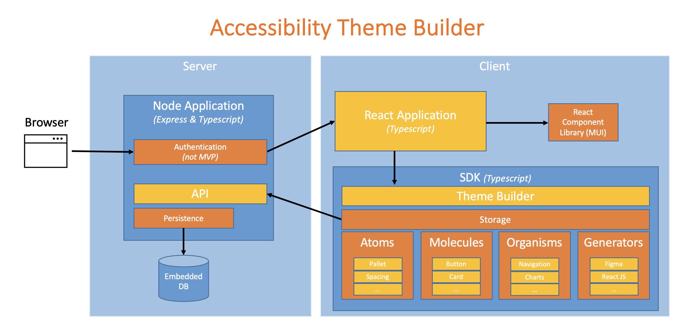

# Component Model

The Accessibility Theme Builder application is has two main components:

* the SDK (written in Typescript) which performs calculations and generates code (e.g. CSS, JSON) for your theme;

* a user-friendly React-based application which not only makes it easy to use the SDK but also displays a visual representation for the atoms, molecules, and organisms so that you can see your theme real-time.

The following diagram shows the overall architecture.

On the left, the browser visits the server application.  This application is a node application which is written in Typescript and uses Express.  This application provides a simple API which is used to persist the user's themes.  This persistence API is written to each time the user clicks the button to save a theme and read from each time the user loads a theme or switches to another one.

On the right is the client which runs inside the browser as a React-based SPA (Single Page Application).  This application uses the popular [MUI React component library](https://mui.com/material-ui/) to render the user interface components and the SDK to manage themes, atoms, molecules, and organisms and to perform code generation (CSS and JSON).