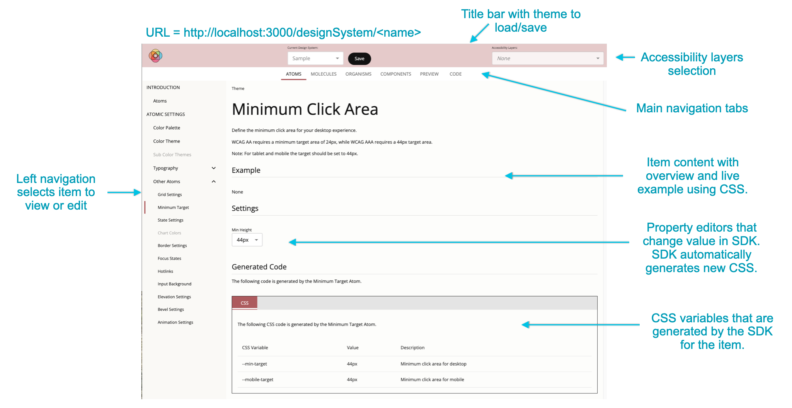

# Extending Atoms, Molecules, or Organisms

This section describes how a developer can extend the Theme Builder application with respect to atomic elements (i.e. atoms, molecules, or organisms).

Although it depends upon your use case, in most cases it will require modifying both:

* the user interface code in the [a11y-theme-builder repository](https://github.com/discoverfinancial/a11y-theme-builder) (see [Extending the User Interface section](#extending-the-user-interface) below), and
* the SDK code in the [a11y-theme-builder-sdk repository](https://github.com/discoverfinancial/a11y-theme-builder-sdk) (see [Extending the SDK](#extending-the-sdk)).

Generally speaking, there are two ways of extending the Theme Builder application with respect to an atomic element:
1. Adding an additional property to an existing atomic element, or
2. Adding a new atomic element.

The sections below describe how to perform these types of extensions for both the SDK and the User Interface.

## Extending the SDK

See [Extending the SDK](https://github.com/discoverfinancial/a11y-theme-builder-sdk/blob/main/DEV-GUIDE.md#extending-the-sdk).

## Extending the User Interface

* Ensure that the SDK is extended first with your new additions, and that this newest SDK version is present in your build.
* Create the React component for the new addition you are planning to make. Ensure it is in the correct directory depending on whether it is a atom, molecule, organism or component.  Be sure to import the SDK extension you made, and pass it as a prop.
* Complete the new React component, by completing a HeadingSection, ExampleSection and Settings Section.
* Add your new component to the correct content page depending on whether it is a atom, molecule, organism or component.

The following image shows the various areas of the Theme Builder editor with the specific files that contribute to its rendering.

* [DesignSystemPage.tsx](https://github.com/discoverfinancial/a11y-theme-builder/blob/main/code/src/ui/src/pages/DesignSystemPage.tsx): The design system page
* [DesignSystemTitleBar.tsx](https://github.com/discoverfinancial/a11y-theme-builder/blob/main/code/src/ui/src/components/DesignSystemTitleBar.tsx): Title bar with save button and accessibility layers
* [AccessibilityLayersButton.tsx](https://github.com/discoverfinancial/a11y-theme-builder/blob/main/code/src/ui/src/components/AccessibilityLayersButton.tsx): Accessibility layers selection dropdown
* [code/src/ui/src/pages/content](https://github.com/discoverfinancial/a11y-theme-builder/tree/main/code/src/ui/src/pages/content): Renders the main navigation tabs
  * [AtomContent.tsx](https://github.com/discoverfinancial/a11y-theme-builder/blob/main/code/src/ui/src/pages/content/atoms/AtomContent.tsx): Renders all atoms
  * [MoleculeContent.tsx](https://github.com/discoverfinancial/a11y-theme-builder/blob/main/code/src/ui/src/pages/content/molecules/MoleculeContent.tsx): Renders all molecules
  * [OrganismContent.tsx](https://github.com/discoverfinancial/a11y-theme-builder/blob/main/code/src/ui/src/pages/content/organisms/OrganismContent.tsx): Renders all atoms
  * [ComponentsContent.tsx](https://github.com/discoverfinancial/a11y-theme-builder/blob/main/code/src/ui/src/pages/content/components/ComponentsContent.tsx): Renders all components
  * [PreviewContent.tsx](https://github.com/discoverfinancial/a11y-theme-builder/blob/main/code/src/ui/src/pages/content/preview/PreviewContent.tsx): Renders preview content
  * [CodeContent.tsx](https://github.com/discoverfinancial/a11y-theme-builder/blob/main/code/src/ui/src/pages/content/code/CodeContent.tsx): Renders code content
* [LeftNavTabs.tsx](https://github.com/discoverfinancial/a11y-theme-builder/blob/main/code/src/ui/src/components/LeftNavTabs.tsx): Each main tab content has a left navigation list that uses the LeftNavTabs component
* [code/src/ui/src/pages/atoms](https://github.com/discoverfinancial/a11y-theme-builder/tree/main/code/src/ui/src/pages/atoms): Location for all atoms
* [code/src/ui/src/pages/molecules](https://github.com/discoverfinancial/a11y-theme-builder/tree/main/code/src/ui/src/pages/molecules): Location for all molecules
* [code/src/ui/src/pages/organisms](https://github.com/discoverfinancial/a11y-theme-builder/tree/main/code/src/ui/src/pages/organisms): Location for all organisms
* [code/src/ui/src/pages/components](https://github.com/discoverfinancial/a11y-theme-builder/tree/main/code/src/ui/src/pages/components): Location for all components
* [code/src/ui/src/components/editors](https://github.com/discoverfinancial/a11y-theme-builder/tree/main/code/src/ui/src/components/editors): Property editors used by atoms, molecules and organisms
* Sections for rendered atoms, molecules, organisms and components
  * [HeadingSection.tsx](https://github.com/discoverfinancial/a11y-theme-builder/blob/main/code/src/ui/src/pages/content/HeadingSection.tsx): Heading section with title and description
  * [ExampleSection.tsx](https://github.com/discoverfinancial/a11y-theme-builder/blob/main/code/src/ui/src/pages/content/ExampleSection.tsx): Example section 
    * [LightModeSection.tsx](https://github.com/discoverfinancial/a11y-theme-builder/blob/main/code/src/ui/src/pages/content/LightModeSection.tsx): Light mode section used to show rendering for light mode
    * [DarkModeSection.tsx](https://github.com/discoverfinancial/a11y-theme-builder/blob/main/code/src/ui/src/pages/content/DarkModeSection.tsx): Dark mode section used to show rendering for dark mode
  * [SettingsSection.tsx](https://github.com/discoverfinancial/a11y-theme-builder/blob/main/code/src/ui/src/pages/content/SettingsSection.tsx): Settings section that contains the property editors
  * [GeneratedCodeSection.tsx](https://github.com/discoverfinancial/a11y-theme-builder/blob/main/code/src/ui/src/pages/content/GeneratedCodeSection.tsx): Code section that shows the CSS variables set by the item and their real-time value

### Walkthrough: Creating a new Atom

We have included an [Example Atom](https://github.com/discoverfinancial/a11y-theme-builder/blob/main/code/src/ui/src/pages/atoms/ExampleAtom.tsx) as a DEMO.

Follow the comments labeled with `DEMO` in the above file and the [Atom Content Page](https://github.com/discoverfinancial/a11y-theme-builder/blob/main/code/src/ui/src/pages/content/atoms/AtomContent.tsx).