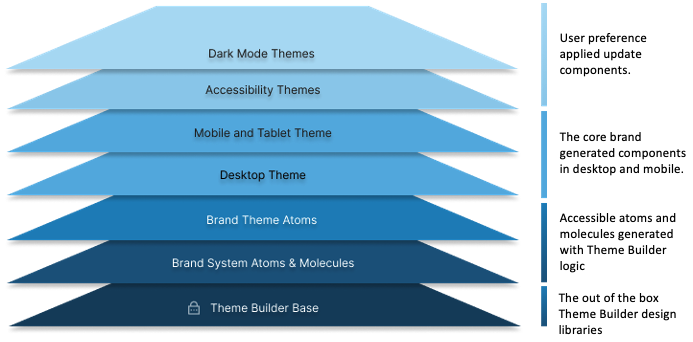
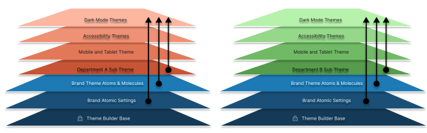
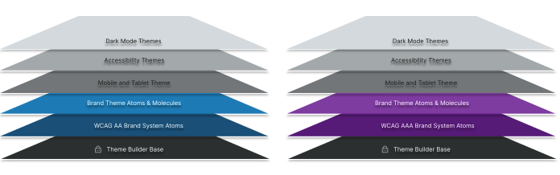

## Systems and Themes
Theme builder distinguishes between system and theme atoms.  

Each theme is layered on top of the core design system.The default theme rendered is either desktop or mobile in light mode.  But additional themes can be layered to create endless additional experiences.

Additional theme layers can be applied by the user to generate themes that are effectively a combination of atomic layers. Initially layering support is provided for the following accessibility preferences:

* Dyslexic preferences
  * This updates all the fonts to Open Dyslexic 
  * Increases line heights for improved readability for dyslexic end users
  * (*Future*) Color contrast options

* Motion sensitivity preferences
  * Removes animations from all components

* Color blind preferences
  * Users can choose to adjust the colors of the branded components to colors that best accommodate their specific color perception deficiency Protanopia, Deuteranopia, and Tritanopia
  * The updated colors meet the WCAG contrast guidelines and are non-jarring and visually pleasing

Themes can also be organization into different sub themes. For example rendering experiences with different system color palette combinations.  

To better understand the power of the Theme Builder, let us imagine we need to build an entire Design System to meet the legal requirements of WCAG AA guidelines (Enterprise Grade) and then find we need a WCGA AAA compliant (Government Grade) system for a government contract. 

Typically, this would be very challenging. However, with the Theme Builder all we need to do is:

1. Duplicate our AA compliant design system 
2. Update one atomic setting for the WCAG compliance from AA to AAA.
    * The atomic elements of new design system will be automatically updated:
        * Colors and contrast will be automatically updated to meet the elevated requirements
        * Line heights updated
        * Character spacing is updated 
3. Save the new Design System. 

