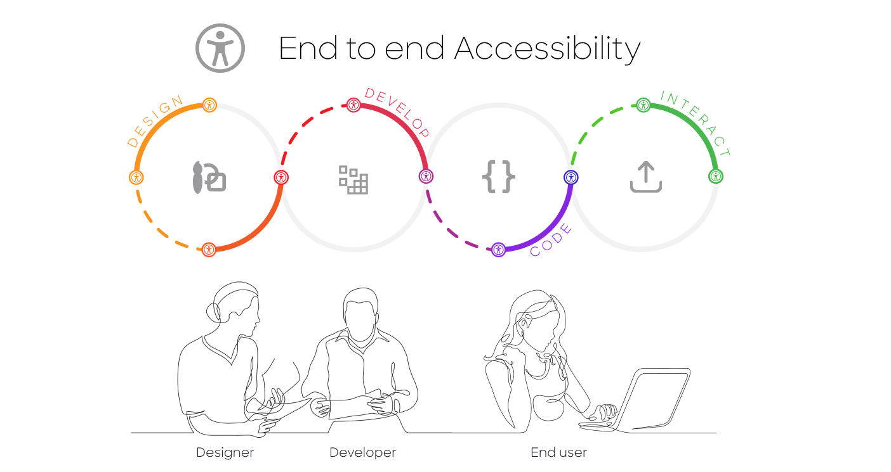

Web Accessibility (or e- Accessibility) pertains to the design of websites and mobile applications that do not present barriers of access to people with disabilities or disorders. The development of these digital solutions need to consider accessibility compliance along the entire production workflow from design, to development, to printing/rendering. 

Enterprises and Governments (herein, "Institutions") need to manage the balance between risk compliance, user experience and, accessibility inclusion when developing digital solutions (mobile, web). However, several end-to-end collaboration challenges exist between designers and developers as it relates to the creation of risk compliant accessibility solutions:

## Institution Perspective 
1. Lack of WCAG AA or AAA compliance increases exposures to fines and lawsuits.
2. Highly leveraged on 3rd party service to identify and help fix accessibility tools.
3. Desktop and mobile experiences are often not aligned.

## Developer Perspective
1. Component reuse is not optimized.
2. Design libraries do not leverage continuous improvement and continuous deployment processes.
3. Design to development lifecycle tends to be slow 
4. Too much time and money implementing and not enough time innovating and testing.

## Designer Perspective
1. Brand and product teams do not always share design assets.
2. Design Libraries do not meet accessibility standards yielding internal and external solutions with the same issues. 
3. Developers lack access to the tools the designers are using. 
4. Developers do not adhere to designs and create their own design variation.

