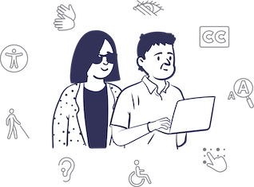
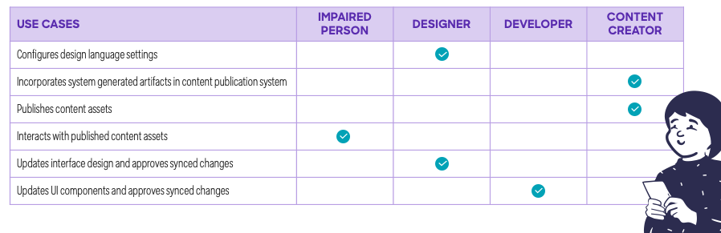

## Inspiration
Atomic Design is a methodology, developed by [Brad Frost](https://bradfrost.com/blog/post/atomic-web-design/), for creating design systems.

The methodology enables the creation of scalable systems, reusable components, and design systems. While originally associated with the design of web interfaces, this methodology can be applied to a wide array of design domains. There are five distinct levels in Atomic Design:

| Component | Description |
| --- | --- |
| Atoms     | Atoms represent the smallest entity in UI elements and they can’t be broken down any further. They serve as the foundational building blocks of your interface. Some examples are: colors, fonts, animations and single images. |
| Molecules | Molecules are groups of compound atoms. Molecules are associated with distinct properties and serve as the backbone of design systems. In the web arena, molecules depict simple UI elements functioning together as a unit. Some   examples are: a form label, search input, and buttons. |
| Organisms | Organisms are groups of molecules and/or atoms joined together to form a relatively complex, distinct section of an interface.  Examples include: navigation, sidebars, forms, and popups. |
| Templates | Templates consist mostly of groups of organisms stitched together to define the structure (design) of possible pages. Templates are void of real content. |
| Pages     | Pages are instances of templates that contain real content. Essentially, they combine all the components of a design coupled with real data. |

Atomic Design provides a clear methodology for crafting design systems based on a series of related building blocks (design components).

## Accessibility
[Web Accessibility (or e-Accessibility)](https://en.wikipedia.org/wiki/Web_accessibility) pertains to the design of websites and mobile applications that do not present barriers of access to people with disabilities or disorders. Yet the [principles of inclusion](https://en.wikipedia.org/wiki/Inclusion_(disability_rights)) that *e-Accessibility* attempts to address are not limited to digital interfaces. The broader challenge is to address the inaccessible use or access of instruments or interfaces in physical as well as digital environments in a common and consistent manner. The process of printing physical instruments (i.e.: menus, tickets, Credit cards, contracts, identity documents) requires the same a priori knowledge of impairment preferences as the process for rendering digital interfaces.

Given the challenges associated with risk compliance for people with disabilities (Visual, Motion, Motor, Auditory, Seizures, Cognitive/Learning), Atomic Design enables designers and developers to establish a round-trip workflow process that traverses from abstract concepts to concrete details. The application of Atomic Design concepts towards the development of accessibly compliance solutions can yield consistency and scalability while mitigating regulatory risk.

An **Atomic Accessibility Design Methodology** extrapolates the concepts of atomic design to provide a general purpose approach to the systematic publishing/rendering of accessible content relating to physical and digital instruments.

| Component | Description |
| --- | --- |
| Atoms     | Atoms represent micro-services associated with partial aspects of content publishing/rendering process. For example the handling of content attributes or elements. |
| Molecules | Molecules are groups of compound atoms. Molecules are associated with distinct properties and serve as the backbone of design systems. Molecules represent micro-services associated with the processing of groups of compound atoms.  For example the handling of content features. |
| Organisms | Organisms are macro-services that group together molecules and/or atoms to address disability/disorder specific needs.  Examples include dyslexia, motion sensitivity, color blindness. |
| Themes | Themes consist mostly of groups of organisms stitched together to define the structure (design) of yet-to-be published content types. Themes are void of real content. |
| Instruments | Digital or physical instances where content is printed/rendered using a theme and applying the the theme to real content. Essentially, they combine all the components of a design coupled with real data. |

## Scope
An **Atomic Accessibility Design Methodology** is applicable to a range of disabilities and disorders that impact the experience individuals have when interacting with physical and digital content. 

The list of such impairments include but is not limited to:

* Learning - difficulty in one or more areas of learning
* Motion - sensitivity to surroundings with visual motion or repetitive patterns
* Mobility - difficulty walking or climbing stairs
* Cognition - difficulty concentrating, remembering, or making decisions
* Independent Living - difficulty doing errands alone
* Hearing - difficulty hearing
* Vision - difficulty seeing
* Self-care - difficulty dressing or bathing

