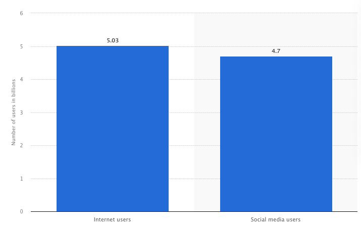

A wide range of disabilities and disorders (impairments) prevent billions of people globally from interacting with physical and digital instruments that are socially and economically necessary. The demand for accessibly inclusive products is rising. An enormous number of global companies (Content Creators or Producers) that publish these instruments to be consumed, need to consistently generate risk compliant instruments.

For example, vision impairments alone present a global financial burden with the annual global costs of productivity losses associated with vision impairment estimated to be US $411 billion. Regardless of the cause, most people with vision impairment and blindness are over the age of 50 years; however, vision loss can affect people of all ages.

Given a [world population of 8 billion](https://www.worldometers.info/world-population/), where the [number of internet and social media users worldwide is 5 billion people](https://www.statista.com/statistics/617136/digital-population-worldwide/) and at least 2.2 billion people globally suffer from visual disabilities -- the need to address loss of productivity and diminished quality of life for this demographic in the digital age is paramount.

While governments and businesses have embraced accessibility standards, the implementations are complex thereby yielding compliance challenges and shortcomings. However, the availability of a **theme builder** that generates machine readable asset types to be used by design systems to publish products that are accessibly inclusive could be provide much needed assistance to designers, developers and testers. Such a system would leverage a set of foundational services that can dynamically calculate accessibility constraints for a range of disabilities and disorders. The theme builder would systematically orchestrate for a designer the interrelationships between atomic design elements to yield design system themes that reduce accessibly inclusive complexities.