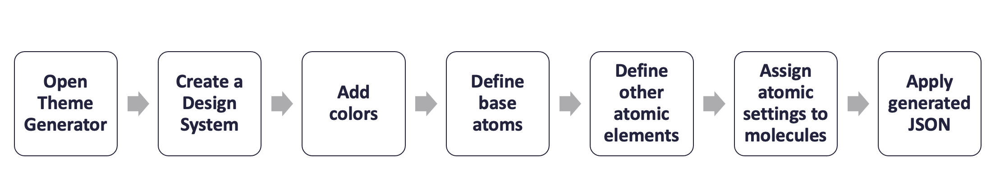

## Unified Design

Our desired solution is possible if we apply the concepts of a *Unified Design* system consisting of the following a building blocks:

## Atomic Accessibility Design
### Inspiration
Atomic Design is a methodology, developed by [Brad Frost](https://bradfrost.com/blog/post/atomic-web-design/), for creating design systems.

The methodology enables the creation of scalable systems, reusable components, and design systems. While originally associated with the design of web interfaces, this methodology can be applied to a wide array of design domains. There are five distinct levels in Atomic Design:

| Component | Description |
| --- | --- |
| Atoms     | Atoms represent the smallest entity in UI elements and they can’t be broken down any further. They serve as the foundational building blocks of your interface. Some examples are: colors, fonts, animations and single images. |
| Molecules | Molecules are groups of compound atoms. Molecules are associated with distinct properties and serve as the backbone of design systems. In the web arena, molecules depict simple UI elements functioning together as a unit. Some   examples are: a form label, search input, and buttons. |
| Organisms | Organisms are groups of molecules and/or atoms joined together to form a relatively complex, distinct section of an interface.  Examples include: navigation, sidebars, forms, and popups. |
| Templates | Templates consist mostly of groups of organisms stitched together to define the structure (design) of possible pages. Templates are void of real content. |
| Pages     | Pages are instances of templates that contain real content. Essentially, they combine all the components of a design coupled with real data. |

Atomic Design provides a clear methodology for crafting design systems based on a series of related building blocks (design components).

### Accessibility
[Web Accessibility (or e-Accessibility)](https://en.wikipedia.org/wiki/Web_accessibility) pertains to the design of websites and mobile applications that do not present barriers of access to people with disabilities or disorders. Yet the [principles of inclusion](https://en.wikipedia.org/wiki/Inclusion_(disability_rights)) that *e-Accessibility* attempts to address are not limited to digital interfaces. The broader challenge is to address the inaccessible use or access of instruments or interfaces in physical as well as digital environments in a common and consistent manner. The process of printing physical instruments (i.e.: menus, tickets, Credit cards, contracts, identity documents) requires the same a priori knowledge of impairment preferences as the process for rendering digital interfaces.

Given the challenges associated with risk compliance for people with disabilities (Visual, Motion, Motor, Auditory, Seizures, Cognitive/Learning), Atomic Design enables designers and developers to establish a round-trip workflow process that traverses from abstract concepts to concrete details. The application of Atomic Design concepts towards the development of accessibly compliance solutions can yield consistency and scalability while mitigating regulatory risk.

An **Atomic Accessibility Design Methodology** extrapolates the concepts of atomic design to provide a general purpose approach to the systematic publishing/rendering of accessible content relating to physical and digital instruments.

| Component | Description |
| --- | --- |
| Atoms     | Atoms represent micro-services associated with partial aspects of content publishing/rendering process. For example the handling of content attributes or elements. |
| Molecules | Molecules are groups of compound atoms. Molecules are associated with distinct properties and serve as the backbone of design systems. Molecules represent micro-services associated with the processing of groups of compound atoms.  For example the handling of content features. |
| Organisms | Organisms are macro-services that group together molecules and/or atoms to address disability/disorder specific needs.  Examples include dyslexia, motion sensitivity, color blindness. |
| Themes | Themes consist mostly of groups of organisms stitched together to define the structure (design) of yet-to-be published content types. Themes are void of real content. |
| Instruments | Digital or physical instances where content is printed/rendered using a theme and applying the the theme to real content. Essentially, they combine all the components of a design coupled with real data. |

### Scope
An **Atomic Accessibility Design Methodology** is applicable to a range of disabilities and disorders that impact the experience individuals have when interacting with physical and digital content. 

The list of such impairments include but is not limited to:

* Learning: Difficulty in one or more areas of learning
* Motion: Sensitivity to surroundings with visual motion or repetitive patterns
* Mobility: Difficulty walking or climbing stairs
* Cognition: Difficulty concentrating, remembering, or making decisions
* Independent Living: Difficulty doing errands alone
* Hearing: Difficulty hearing
* Vision: Difficulty seeing
* Self-care: Difficulty dressing or bathing

## Theme Builder

The Theme Builder is a tool that combines brand design input + the structure of atomic design +  logic to generate accessible atoms and molecules to output code which transforms a robust, out of the box Design Library and a React Component Library into a Branded and accessible Unified Design System. 

### Conceptual Workflow

For each of the following steps, a theme builder *User* may be a *Designer* or *Impaired Person*.

1. *User* opens Theme Building Tool.
2. *User* creates a new design system project within the Theme Building Tool.
3. *User* configures project to produce themes that are either Business (AA) or Government (AAA) [WCAG Compatible][WCAG].
4. *User* adds 10 shades of a color in light and dark mode with corresponding "on color" to the project.
5. *User* defines the base atoms for the theme. This lays the foundation for all light and dark mode calculations. The Theme Building Tool guides the *User* through the following steps that **must** occur in sequential order:

   1. Select Primary, Secondary, and Tertiary Colors
   2. Define Light mode background and dark mode background.
   3. Define Gradient backgrounds, Buttons and Icons colors, and Gradient Text.

6. *User* defines other atomic elements (atoms, molecules) that will be used by the theme. The Theme Building Tool guides the *User* through the following steps:

   1. Data independent preferences
      1. Specify minimum desktop target area
      2. Specify grid system
      3. Specify animation settings
   2. Data dependent preferences using decisions associated with Primary, Secondary, Tertiary, Light and Dark Mode background colors. These attribute values are calculated:
      1. state colors
      2. Fonts / Typography
      3. Default Border Settings
      4. Elevations
      5. Bevels
      6. Chart colors

7. *User* applies atomic settings to molecules associated with the theme project.
8. *User* uses the Theme Building Tool to generate theme asset types (JSON, CSS, design tokens).

## Systems and Themes
Theme builder distinguishes between system and theme atoms.  

Each theme is layered on top of the core design system.The default theme rendered is either desktop or mobile in light mode.  But additional themes can be layered to create endless additional experiences.

Additional theme layers can be applied by the user to generate themes that are effectively a combination of atomic layers. Initially layering support is provided for the following accessibility preferences:

* Dyslexic preferences
  
     * This updates all the fonts to Open Dyslexic 
     * Increases line heights for improved readability for dyslexic end users
     * (*Future*) Color contrast options

* Motion sensitivity preferences
  
    * Removes animations from all components

* Color blind preferences
  
    * Users can choose to adjust the colors of the branded components to colors that best accommodate their specific color perception deficiency Protanopia, Deuteranopia, and Tritanopia
    * The updated colors meet the WCAG contrast guidelines and are non-jarring and visually pleasing

Themes can also be organization into different sub themes. For example rendering experiences with different system color palette combinations.  

To better understand the power of the Theme Builder, let us imagine we need to build an entire Design System to meet the legal requirements of WCAG AA guidelines (Enterprise Grade) and then find we need a WCGA AAA compliant (Government Grade) system for a government contract. 

Typically, this would be very challenging. However, with the Theme Builder all we need to do is:

1. Duplicate our AA compliant design system 
2. Update one atomic setting for the WCAG compliance from AA to AAA.
    * The atomic elements of new design system will be automatically updated:
        * Colors and contrast will be automatically updated to meet the elevated requirements
        * Line heights updated
        * Character spacing is updated 
3. Save the new Design System. 

## DesignOps Toolchain

A **DesignOps Toolchain** keeps the Design Component Library, the Digital Component Library and the CSS Library in sync. 

For example, assuming the use of [Figma]() as prototyping tool, a *Designer* can push changes from the master Figma design library to a staging component library repo. 

Alternatively, changes can also be pushed from the staging repo to Figma.  

>Note: This only demonstrates the work flow not the approval processes.  This toolchain utilizes Figma Tokens, Figma, GitHub, a React Component Library and Chromatic (a paid and enhanced version of Storybook).

<!--- Reusable Inline Named Links  --->

[WCAG]: https://www.w3.org/TR/WCAG21/
[M2DESIGN]: https://m2.material.io/design/
[BOOTDESIGN]: https://themes.getbootstrap.com/official-themes/
[WORKBENCH]: https://storybook.js.org/

