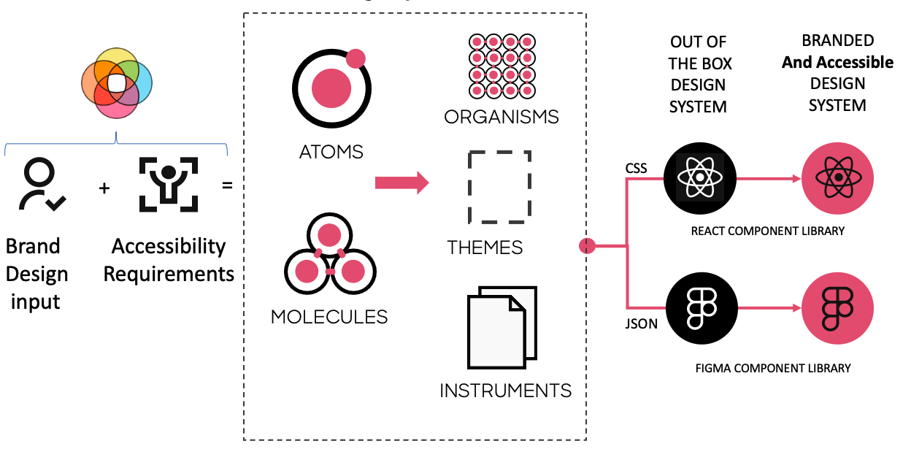
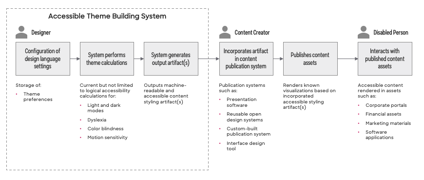
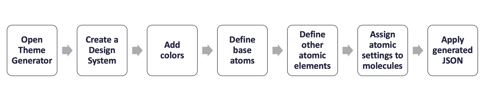

## Theme Builder

The Theme Builder is a tool that combines brand design input + the structure of atomic design +  logic to generate accessible atoms and molecules to output code which transforms a robust, out of the box Design Library and a React Component Library into a Branded and accessible Unified Design System. 

### Conceptual Workflow

For each of the following steps, a theme builder *User* may be a *Designer* or *Impaired Person*.

1. *User* opens Theme Building Tool.
2. *User* creates a new design system project within the Theme Building Tool.
3. *User* configures project to produce themes that are either Business (AA) or Government (AAA) [WCAG Compatible][WCAG].
3. *User* adds 10 shades of a color in light and dark mode with corresponding "on color" to the project.
4. *User* defines the base atoms for the theme. This lays the foundation for all light and dark mode calculations. The Theme Building Tool guides the *User* through the following steps that **must** occur in sequential order:

   1. Select Primary, Secondary, and Tertiary Colors
   2. Define Light mode background and dark mode background.
   3. Define Gradient backgrounds, Buttons and Icons colors, and Gradient Text.

5. *User* defines other atomic elements (atoms, molecules) that will be used by the theme. The Theme Building Tool guides the *User* through the following steps:

   1. Data independent preferences
      1. Specify minimum desktop target area
      2. Specify grid system
      3. Specify animation settings
   2. Data dependent preferences using decisions associated with Primary, Secondary, Tertiary, Light and Dark Mode background colors. These attribute values are calculated:
      1. state colors
      2. Fonts / Typography
      3. Default Border Settings
      4. Elevations
      5. Bevels
      6. Chart colors

6. *User* applies atomic settings to molecules associated with the theme project.
7. *User* uses the Theme Building Tool to generate theme asset types (JSON, CSS, design tokens).

<!--- Reusable Inline Named Links  --->

[WCAG]: https://www.w3.org/TR/WCAG21/
[M2DESIGN]: https://m2.material.io/design/
[BOOTDESIGN]: https://themes.getbootstrap.com/official-themes/
[WORKBENCH]: https://storybook.js.org/

